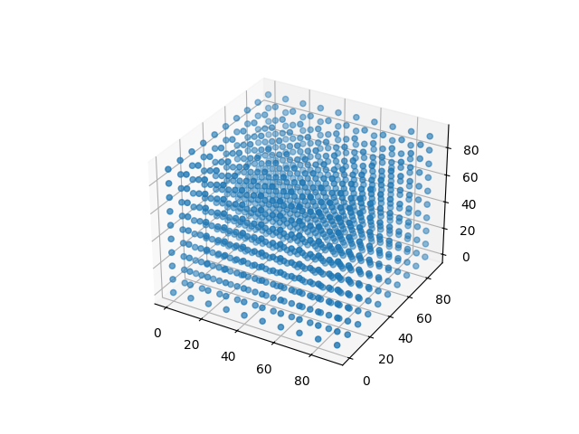

# NumPy Linear Algebra

A collection of practical NumPy exercises focused on:

- linear algebra
- matrix operations
- broadcasting
- vector projections
- geometric transformations
- 3D visualization
- performance benchmarking

This repository contains hands-on exercises exploring mathematical concepts commonly used in:

- Data Science
- Machine Learning
- Computer Vision
- Robotics
- Scientific Computing
- Game Development

---

# Technologies

- Python
- NumPy
- Matplotlib

---

# Topics Covered

## 1. 3D Data Simulation & Visualization

**File:** `arrays_in_numpy.py`

Generate multidimensional coordinate grids using:

- `np.linspace()`
- `np.meshgrid()`
- `matplotlib`

The generated data is visualized as a 3D scatter plot.

### Example Visualization



---

## 2. NumPy Broadcasting Rules

**File:** `broadcasting.py`

Custom implementation of NumPy broadcasting compatibility checks.

Concepts covered:

- array shapes
- dimension alignment
- broadcasting rules
- shape expansion

---

## 3. Normal Vector Calculation

**File:** `linear_algebra_numpy.py`

Calculate a normal vector to a plane defined by three points in 3D space using:

- vector subtraction
- cross product
- vector normalization

Core equation:

\[
\vec{n} = \vec{AB} \times \vec{AC}
\]

Applications:
- robotics
- computer graphics
- physics simulations

---

## 4. NumPy vs Python Performance Benchmark

**File:** `nparrays.py`

Performance comparison between:
- Python lists
- NumPy arrays

Benchmarked operations:
- addition
- multiplication
- exponentiation

Implemented using:
- `timeit`
- vectorized NumPy operations

---

## 5. Vector Projection

**File:** `vector_projection.py`

Projection of one vector onto another using linear algebra formulas.

Projection formula:

\[
\mathrm{proj}_{\vec b}\vec a =
\frac{\vec a \cdot \vec b}{\|\vec b\|^2}\vec b
\]

Applications:
- cosine similarity
- machine learning
- graphics programming
- physics

---

## 6. Matrix Transformations & Character Movement

**File:** `matrix_transformation.py`

Simulation of character movement on a 2D board using:

- homogeneous coordinates
- translation matrices
- matrix multiplication

Translation matrix:

\[
\begin{bmatrix}
1 & 0 & dx \\
0 & 1 & dy \\
0 & 0 & 1
\end{bmatrix}
\]

Concepts covered:
- geometric transformations
- translation matrices
- board boundary constraints
- matrix multiplication

---

## 7. NumPy Type Casting & Type Promotion

**File:** `type_casting.py`

Check whether NumPy operations automatically change array data types.

Concepts covered:

- NumPy dtypes
- type promotion
- array operations
- numerical precision

---

# Repository Structure

```bash
.
├── arrays_in_numpy.py
├── broadcasting.py
├── linear_algebra_numpy.py
├── matrix_transformation.py
├── nparrays.py
├── type_casting.py
├── vector_projection.py
│
├── images/
│   └── 3d_scatter.png
│
└── README.md
```

---

# Installation

Clone the repository:

```bash
git clone https://github.com/your-username/your-repository.git
```

Install dependencies:

```bash
pip install numpy matplotlib
```

---

# Running Examples

Run any exercise individually:

```bash
python vector_projection.py
```

or:

```bash
python linear_algebra_numpy.py
```

---

# Learning Goals

This repository focuses on building intuition for:

- vectorized computation
- linear algebra with NumPy
- multidimensional arrays
- broadcasting
- geometric transformations
- scientific computing workflows

---

# Author

Created as part of practical NumPy and linear algebra exercises.
